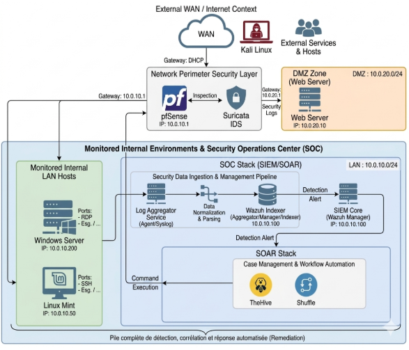

# NG-SOC — Next-Generation Security Operations Center

> Wazuh SIEM/EDR + Suricata IDS/IPS + pfSense + Shuffle SOAR + TheHive, deployed as a containerized, defense-in-depth lab, with automated detection-to-remediation playbooks.

**Authors:** Adnane El Bayaz & Abderrahmane Saouf — ENSA El Jadida, 2ᵉ Année CCN
**Supervisor:** Prof. Ouaissa Mariyam
**Full academic report:** [`docs/Rapport_PFA-NGSOC_VF.pdf`](docs/Rapport_PFA-NGSOC_VF.pdf)

<!-- TODO: add your architecture diagram here -->
<!--  -->

## What this is

A from-scratch NG-SOC lab built to close the gap between passive log collection and active, automated response. Instead of stopping at "the SIEM shows an alert," this project wires detection all the way through to remediation: Wazuh detects → Shuffle enriches and orchestrates → TheHive tracks the case → pfSense blocks the attacker — with a human-in-the-loop unblock mechanism for false positives.

## Stack

| Layer | Tool | Role |
|---|---|---|
| SIEM / EDR | [Wazuh](https://wazuh.com) | Log correlation, FIM, host telemetry, MITRE ATT&CK mapping |
| Network IDS/IPS | [Suricata](https://suricata.io) | Deep packet inspection, custom detection rules |
| Firewall / Gateway | [pfSense](https://www.pfsense.org) | Perimeter defense, WAN/LAN/DMZ segmentation, active blocking |
| SOAR | [Shuffle](https://shuffler.io) | Workflow orchestration, IoC enrichment, automated remediation |
| Case Management | [TheHive](https://thehive-project.org) | Incident tracking, observable correlation |
| Containerization | Docker | Isolated, portable deployment of Shuffle/TheHive |

## Architecture

```
Internet (WAN) → pfSense (+ Suricata IDS/IPS) → ┬─ DMZ (10.0.20.0/24): Web server
                                                  └─ LAN (10.0.10.0/24): Wazuh, SOAR stack, monitored hosts
```

Full topology, IP scheme, and component breakdown: [`ARCHITECTURE.md`](ARCHITECTURE.md)

## What it detects (validated with real attack simulations)

- **Network recon** — Nmap SYN stealth scans → Suricata + Wazuh correlated alerts
- **Volumetric DoS** — UDP flood against DNS (port 53) → detected and logged in real time
- **Credential dumping** — Mimikatz LSASS access → caught via Sysmon Event ID 1 + Wazuh source/target image correlation
- **Privilege escalation** — `sudo` to root on Linux hosts → Wazuh Rule ID 5402

Full walkthroughs: [`attack-scenarios/`](attack-scenarios/)

## Automated response (SOAR)

On a high-fidelity alert, the Shuffle playbook:
1. Ingests the Wazuh alert via webhook
2. Enriches the IoC (IP reputation lookups)
3. Creates a case in TheHive with observables attached
4. Pushes the attacker IP into pfSense's `SOAR_Blocklist` table (active block)
5. Notifies the SOC team via Discord + email
6. Email includes a one-click **Unblock** action for false-positive recovery

Exported workflow definitions: [`soar-playbooks/`](soar-playbooks/)

## Reproducing this lab

See [`infrastructure/`](infrastructure/) for the Docker Compose stack and pfSense interface configuration. You'll need:
- A hypervisor (VMware Workstation Pro / VirtualBox) to segment WAN/LAN/DMZ
- Docker + Docker Compose for Shuffle and TheHive
- A pfSense VM with Suricata installed as a package
- A Windows host (Sysmon installed) and a Linux host as monitored endpoints
- A Kali Linux VM for attack simulation

## Results

MTTR reduced from manual (minutes) to automated (seconds) for high-fidelity alerts. See [`results/mttr-mttd-metrics.md`](results/mttr-mttd-metrics.md).

## License

See [`LICENSE`](LICENSE).
